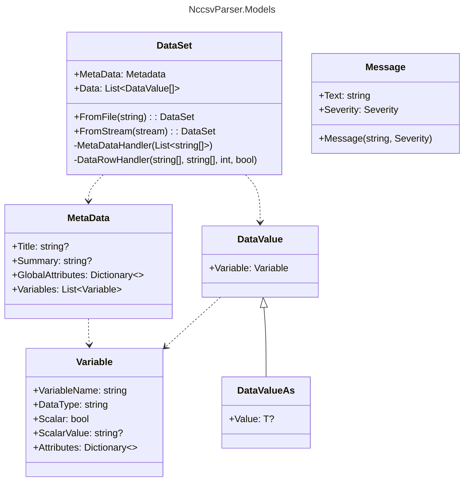

```mermaid
---
title: NccsvParser.Models
---

classDiagram

DataValue <|-- DataValueAs
DataSet ..> MetaData
DataSet ..> DataValue
MetaData ..> Variable
DataValue ..> Variable

class DataSet{
    +MetaData: Metadata
    +Data: List~DataValue[]~
    +FromFile(string): DataSet
    +FromStream(stream): DataSet
    -MetaDataHandler(List~string[]~)
    -DataRowHandler(string[], string[], int, bool)
}

class DataValue{
    +Variable: Variable
}

class DataValueAs{
    +Value: T?
}

class MetaData{
    +Title: string?
    +Summary: string?
    +GlobalAttributes: Dictionary<>
    +Variables: List~Variable~
}

class Variable{
    +VariableName: string
    +DataType: string
    +Scalar: bool
    +ScalarValue: string?
    +Attributes: Dictionary<>
}

class Message{
    +Text: string
    +Severity: Severity
    +Message(string, Severity)
}

```
