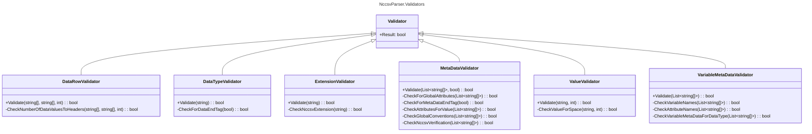

```mermaid
---
title: NccsvParser.Validators
---

classDiagram

Validator <|-- DataRowValidator
Validator <|-- DataTypeValidator
Validator <|-- ExtensionValidator
Validator <|-- MetaDataValidator
Validator <|-- ValueValidator
Validator <|-- VariableMetaDataValidator

class Validator{
    +Result: bool
}

class DataRowValidator{
    +Validate(string[], string[], int): bool
    -CheckNumberOfDataValuesToHeaders(string[], string[], int): bool
}

class DataTypeValidator{
    +Validate(string): bool
    -CheckForDataEndTag(bool): bool
}

class ExtensionValidator{
    +Validate(string): bool
    -CheckNccsvExtension(string): bool
}

class MetaDataValidator{
    +Validate(List~string[]~, bool):bool
    -CheckForGlobalAttributes(List~string[]~): bool
    -CheckForMetaDataEndTag(bool): bool
    -CheckAttributesForValue(List~string[]~): bool
    -CheckGlobalConventions(List~string[]~): bool
    -CheckNccsvVerification(List~string[]~): bool
}

class ValueValidator{
    +Validate(string, int): bool
    -CheckValueForSpace(string, int): bool
}

class VariableMetaDataValidator{
    +Validate(List~string[]~): bool
    -CheckVariableNames(List~string[]~): bool
    -CheckAttributeNames(List~string[]~): bool
    -CheckVariableMetaDataForDataType(List~string[]~): bool
}

```
