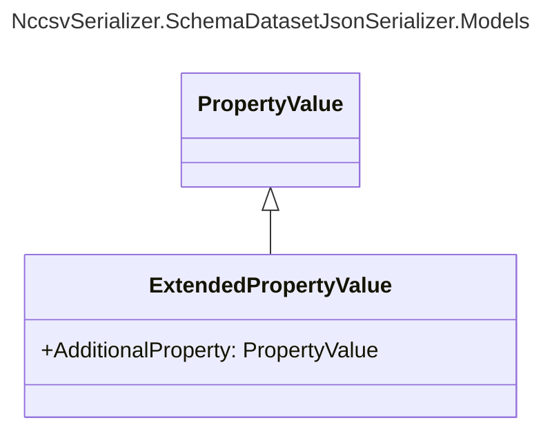
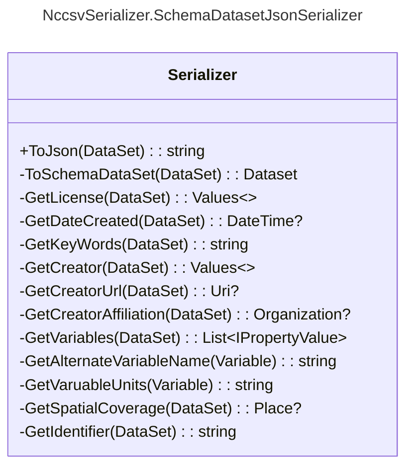

```mermaid
---
title: NccsvSerializer.SchemaDatasetJsonSerializer.Models
---

classDiagram

PropertyValue <|-- ExtendedPropertyValue

class ExtendedPropertyValue{
    +AdditionalProperty: PropertyValue
}

```

```mermaid
---
title: NccsvSerializer.SchemaDatasetJsonSerializer
---

classDiagram

class Serializer{
    +ToJson(DataSet): string
    -ToSchemaDataSet(DataSet): Dataset
    -GetLicense(DataSet): Values<>
    -GetDateCreated(DataSet): DateTime?
    -GetKeyWords(DataSet): string
    -GetCreator(DataSet): Values<>
    -GetCreatorUrl(DataSet): Uri?
    -GetCreatorAffiliation(DataSet): Organization?
    -GetVariables(DataSet): List~IPropertyValue~
    -GetAlternateVariableName(Variable): string
    -GetVaruableUnits(Variable): string
    -GetSpatialCoverage(DataSet): Place?
    -GetIdentifier(DataSet): string
}

```
